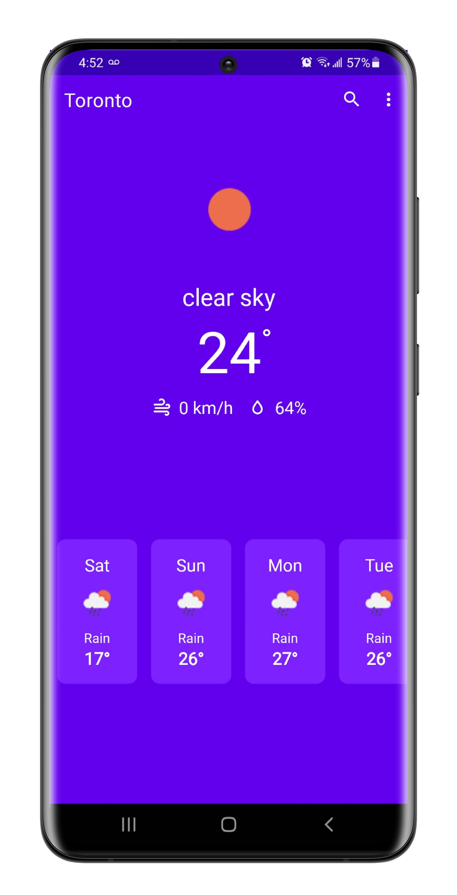
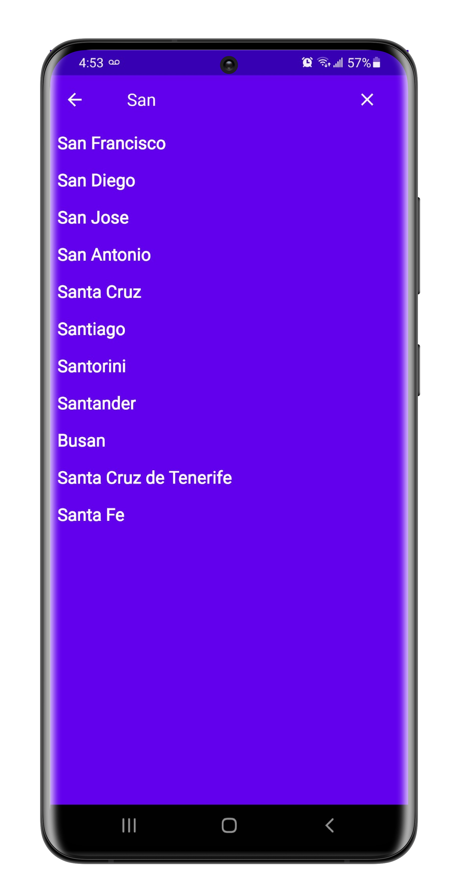

# Weather-Android-App

   
  
  

### Features
- View the current weather
- 7 day forecast
- Search for any location
- Change the units (Celcius or Fahrenheit)

### Dependencies
- Jetpack Navigation 
  - Navigating from Home Screen to Location Search
- Retrofit + Moshi
  - Retrofit to fetch the weather data and Moshi to parse JSON into objects
- Dagger-Hilt (Dependency Injection)
- MVVM Architecture (Model-View-ViewModel)

### OpenWeatherAPI
- Get a free API key from [OpenWeatherMap](https://openweathermap.org/)
